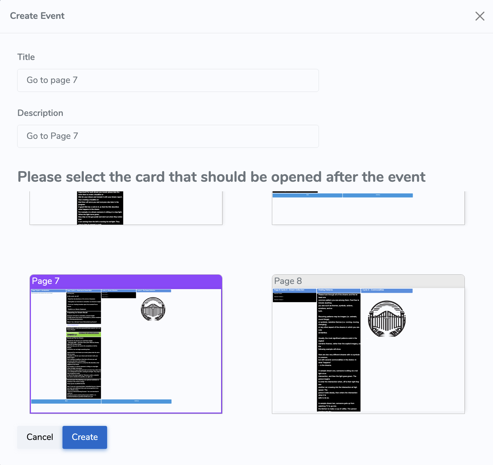
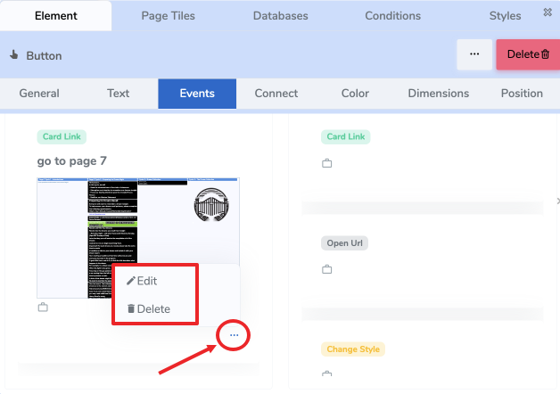
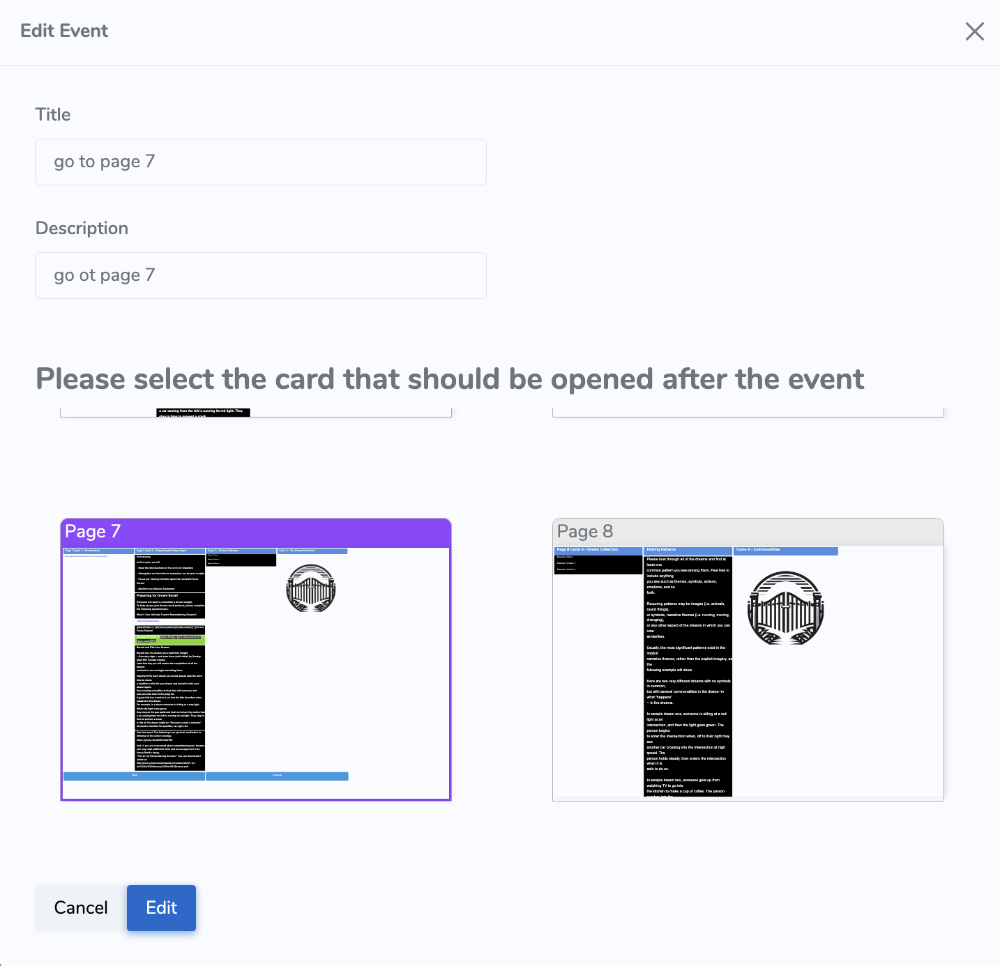

# 🔗 Card Link Event

The **Card Link Event** allows you to navigate from one page (card) to another when a user interacts with an element.  
It’s most commonly used with **buttons**, but **any element** — including images, tiles, or icons — can trigger it.  
ACENji does not limit which element can use which event. Events are completely flexible, and it’s up to the no-code designer to decide what makes sense.

---

## 📝 Concept

Think of a **Card Link** as a **page-to-page navigation** action.  
For example:

> You’re on the **Home** page (Card 1) and want to navigate to the **Product** page (Card 2).  
> You place a **“Product” button** on the Home page, wire it with a **Card Link Event**, and when the user clicks the button at runtime — they’re taken to the Product page.

---

## 🪄 Adding a Card Link Event

1. **Select the element** (e.g., button) on your current page.  
2. Open the **Floating Design Panel** and go to the **Events Tab**.  
3. From the **Available Events**, **drag the _Card Link_ event** into the **Perform an Action** section on the left.

4. A **properties window** will open, where you can configure:  
   - **Title** — internal name to help you identify the event.  
   - **Description** — internal notes to explain the purpose of the event.  
   - **Destination Card** — visually select the page (card) you want to navigate to by clicking on it.

> 📝 *The Title and Description are only visible to creators inside the design panel — they are not shown to end users.*

5. Click **Save**.  
   The event will now appear in the **Perform an Action** list.

---

## ✏️ Editing or Deleting

Once the Card Link event has been created, you can manage it from the **Perform an Action** section:

- Click the **three dots (⋯)** next to the event to:  
  - ✏️ **Edit** — reopen the properties window and change Title, Description, or Destination Card.  
  - 🗑️ **Delete** — remove the event entirely.

> ⚠️ The destination card must exist at all times. If it is deleted or renamed in a way that breaks the link, the event will no longer function.

---

## 🧠 Pro Tip

Card Link events can be combined with other events on the same element.  
For example, a button can **calculate a value** and **navigate to a new page** at the same time.

---

## 📬 Need Help?

- Open a support ticket from your ACENji admin panel  
- Or reach us via [ACENji.com](https://www.acenji.com/contact)

---

✅ That’s it!  
You’ve successfully wired a **Card Link Event** — enabling smooth navigation between pages in your ACENji app.
