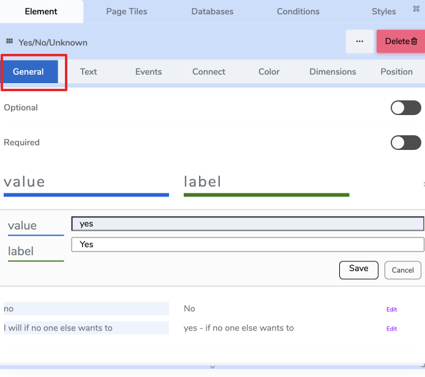

# ⚙️ General Tab

The **General Tab** controls the **core settings** and **behavior** of an Element.  
These settings define how the Element behaves at **runtime** and how it is interpreted inside the **page workflow**.

The General Tab will **adapt depending on the element type**.  
Some elements include additional controls (for example, text inputs include validation rules), while others keep the tab minimal.

> **Important:**  
> Element-specific settings are documented in the **Website Elements** reference section.  
> This page describes the **shared settings** that appear across most elements.

---

## 🧱 Shared Settings

These settings commonly appear in many types of Elements.

| Setting | Description |
|--------|-------------|
| **Label / Name** | A human-friendly title used to recognize the Element in the builder. Does *not* display to end users unless the Element itself shows it. |
| **Default Value** | A starting value assigned when a page or workflow loads. Helpful for Yes/No controls, dropdowns, text fields, or informational states. |
| **Optional** | Allows this Element to be *skipped* during workflow progress. Useful for non-required questions or optional user inputs. |
| **Required** | Forces the user to provide an input before progressing. If enabled, validation occurs at runtime. |
| **Minimize** | Collapses the Element so only the top header row is shown. Keeps pages clean when content is long. |
| **Minimize Height** | Sets how tall the Element appears when minimized. Default is typically **30px**. |
| **Read From Source** | Pulls the Element's value from a variable or data source from other page/tile/element. Ideal for dynamic content. |
| **Functions** | Applies reusable **actions** to the element (e.g., reset, update value, toggle visibility). Used in advanced interaction workflows. |

---

## 🖼️ Example: Yes / No / “If necessary” Choice Field

Below is an example of how some of these shared settings look inside the General Tab.

### **Default Value**
The default selected option when the page loads.

### **Optional / Required**
- **Optional** → user may skip answering.
- **Required** → page cannot continue until a selection is made.

### **Options Table**
Some Elements (like Yes/No/Unknown lists or dropdowns) include a **Value / Label table**:

| value | label | actions |
|------|-------|---------|
| yes | Yes | Edit |
| no | No | Edit |
| i will if no one else wants to | yes – if no one else wants to | Edit |

- **Value** is used internally in logic and variables.
- **Label** is what the end user sees.

---

## 🔄 Element-Specific General Settings

Some settings **only apply to certain Element types**.  
Examples:

| Element Type | Example Element-Specific Setting | Where to Learn More |
|-------------|----------------------------------|--------------------|
| Text Input | Input Type (text/email/number), Placeholder | See **Text Input Element** |
| Image | Image Source, Upload vs URL | See **Image Element** |
| Signature Field | Signature Canvas Style | See **Signature Element** |

> These are documented in the **Website Elements** section, not here.

---
---

## 🧩 Functions (Computed Actions)

**Functions** are small, reusable computations.  
They **read** inputs (element values, variables, constants), **process** them, and **write** an output (to an element or variable).  
They don’t run by themselves — use the **Events** tab to decide *when* to call them (e.g., on change of qty, on load, on submit).

> **Think:** inputs → function → output target

---

### 🔌 How to Wire a Function

1. **Inputs**: choose one or more sources (e.g., `element:qty`, `var:unitPrice`, constant `0.07`).
2. **Function**: pick a computation (e.g., `CALCULATE_PRICE`).
3. **Output**: choose where the result goes (e.g., `element:total`, `var:orderTotal`).

---

### 🗂 Computed Functions (Web v1)

A focused set of **useful, non-generic** building blocks.  
Element-specific functions (e.g., table row ops) are documented on the element’s page.

#### Pricing & Numbers
| Function | Purpose | Typical Inputs | Output |
|---|---|---|---|
| **CALCULATE_PRICE** | Line total with quantity, discounts, and tax. | `unitPrice`, `quantity`, `discount?` (abs or %), `taxRate?` | number |
| **AGGREGATE** | Sum/avg/min/max over a list (e.g., items). | `list`, `field`, `op` (`sum|avg|min|max`) | number |
| **ROUND** | Round to given decimals or step. | `value`, `decimals?`, `mode?` (`half_up|floor|ceil`) | number |
| **PERCENT_OF** | Compute X% of Y. | `percent`, `of` | number |

**Example (CALCULATE_PRICE)**  
Inputs: `unitPrice=var:unitPrice`, `quantity=element:qty`, `discount=var:promoPct`, `taxRate=0.07`  
Output → `element:lineTotal`

#### Lookups & Mapping
| Function | Purpose | Typical Inputs | Output |
|---|---|---|---|
| **LOOKUP** | Return a value from a key/value list or object. | `source`, `key`, `path?` | any |
| **MAP_LIST** | Transform each item by rule. | `list`, `rule` (expression) | list |
| **FILTER_LIST** | Keep items matching a rule. | `list`, `rule` (predicate) | list |

**Example (LOOKUP)**  
Inputs: `source=var:pricingTable`, `key=element:sku`, `path="price"` → Output → `var:unitPrice`

#### Dates & Durations
| Function | Purpose | Typical Inputs | Output |
|---|---|---|---|
| **DATE_ADD** | Add days/months/minutes. | `date`, `amount`, `unit` (`days|months|minutes|...`) | date |
| **DATE_DIFF** | Difference between two dates. | `start`, `end`, `unit` | number |
| **FORMAT_DATE** | Format for display. | `date`, `pattern` | string |

#### Text & IDs
| Function | Purpose | Typical Inputs | Output |
|---|---|---|---|
| **CONCAT** | Concatenate with separator. | `parts[]`, `sep?` | string |
| **NORMALIZE_TEXT** | Trim, collapse spaces, lower/upper. | `text`, `mode` | string |
| **GENERATE_ID** | Short, URL-safe identifier. | `prefix?`, `length?` | string |

#### Validation Helpers (return booleans or messages)
| Function | Purpose | Typical Inputs | Output |
|---|---|---|---|
| **MATCHES_PATTERN** | Regex/format check (email, phone, etc.). | `text`, `pattern` | boolean |
| **WITHIN_RANGE** | Numeric/date bounds. | `value`, `min?`, `max?` | boolean |
| **REQUIRED_IF** | Conditionally require a field. | `condition`, `value` | boolean |

> Results from validation functions typically write to a **variable** (e.g., `var:isValidEmail`) or a **message element**.

---

## 📌 Summary

- The **General Tab** defines the *role and behavior* of the Element.
- It contains a mix of:
  - **Shared global controls** → documented here.
  - **Element-specific controls** → documented in the Element Reference section.
- Values displayed here affect *runtime behavior* and *workflow progression*.

---

## 🔗 Related

- [Elements Overview](#/elements/index.md)
- [Connect Tab](#/elements/connect-tab.md)
- [Website Elements Reference](#/website-elements/index.md)

