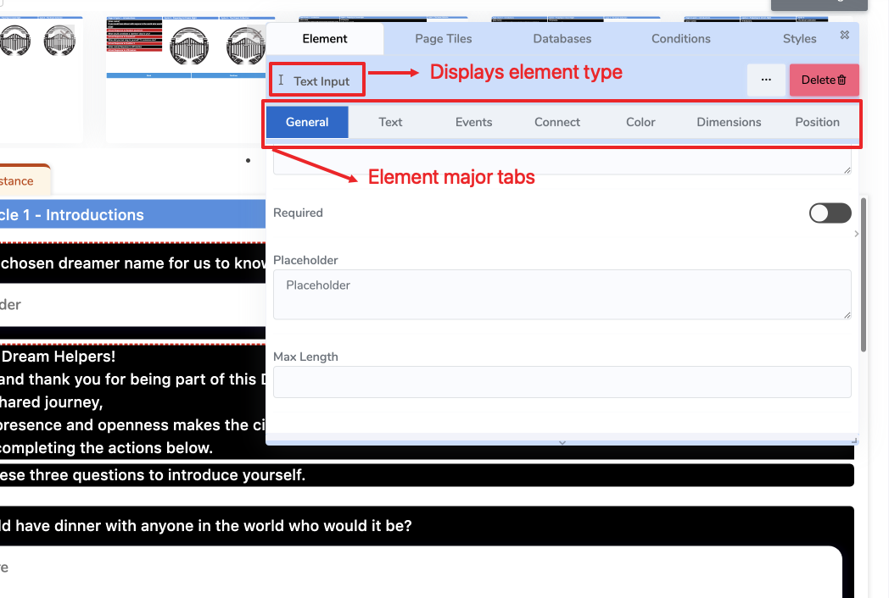

# 📘 Elements

**Elements are the foundational building blocks of every page in ACENji.**  
Think of them as the **ingredients** from which tiles, pages, and entire websites are created. Every visual feature you place on a page—text blocks, images, buttons, input fields, galleries, videos, and more—is an Element.

While there are many types of Elements (see the **[Website Elements](#/website-elements/index.md)** section for a full reference), all of them share a **common property system** that can be configured visually.

---

## 🧩 Elements and the Floating Design Panel

When you place an Element on a page, the **Floating Design Panel** appears.  
This panel lets you edit **all the properties** of the selected Element.  
It also clearly displays the **type of the Element** (e.g., *Info Box*, *Text Input*, *Text Area*) at the top of the panel so you always know what you are editing.

These properties are grouped into **tabs**, each focusing on a specific aspect of the Element’s behavior or appearance.

> 🖼️ *(See the image below for an example highlighting the Element type label and the property tabs.)*
 

---

## ⚙️ Property Tabs Overview

Each Element supports the following property tabs:

- **General Tab**  
  The primary configuration area where you define the Element’s core behavior, identity, and settings.  
  → See the [General Tab](#/elements/general-tab.md) page for details.

- **Text Tab**  
  Defines the text content, formatting, variables, and styling (if the Element supports text).  
  → See the [Text Tab](#/elements/text-tab.md) page for details.

- **Events Tab**  
  Provides event-driven logic for your Element. Events are configured at **design time** and triggered at **runtime** (e.g., on click, on hover, on submit).  
  → See the [Events Tab](#/elements/events/index.md) section for details.

- **Connect Tab**  
  Used to bind the Element to data: assign variables, connect to in-memory data sources, or link to external workflows.  
  → See the [Connect Tab](#/elements/connect-tab.md) page for details.

- **Color Tab**  
  Controls the visual appearance of the Element. Choose colors for different layers and states.  
  → See the [Color Tab](#/elements/color-tab.md) page for details.

- **Dimensions Tab**  
  Defines the size and spatial behavior of the Element.  
  → See the [Dimensions Tab](#/elements/dimensions-tab.md) page for details.

- **Position Tab**  
  Controls the Element’s position within its row or layout container.  
  → See the [Position Tab](#/elements/position-tab.md) page for details.

---

## 📂 What You’ll Learn in This Section

In the **Elements** section, you will learn how to:

1. Understand what Elements are and how they work in ACENji  
2. Configure an Element using the Floating Design Panel  
3. Control the Element’s content, style, layout, and data bindings  
4. Trigger behaviors using events and logic  
5. Build complex pages from simple, reusable Elements  

> Each property tab listed above has its **own dedicated page** as a child of this section.

---

## 🔗 Related

- [Website Elements](#/website-elements/index.md) – A reference library of all available element types  
- [Website Builder](#/website-builder/index.md) – How elements are used to build complete pages and workflows  

---

## 📌 Next Steps

- [General Tab](#/elements/general-tab.md)  
- [Text Tab](#/elements/text-tab.md)  
- [Events](#/elements/events/index.md)  
- [Connect Tab](#/elements/connect-tab.md)  
- [Color Tab](#/elements/color-tab.md)  
- [Dimensions Tab](#/elements/dimensions-tab.md)  
- [Position Tab](#/elements/position-tab.md)
