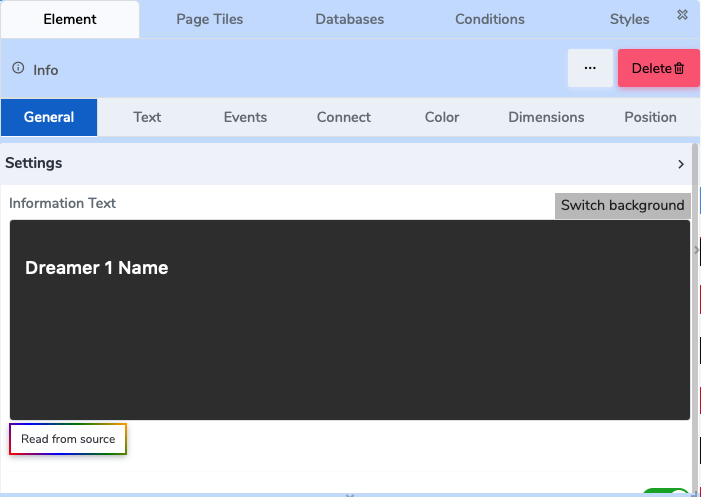
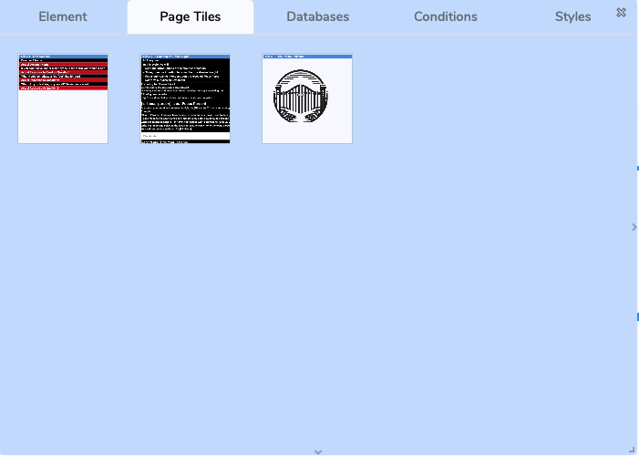

# 🎨 Floating Design Panel

When you start creating a **web page**, a **template**, a **tile**, or adding a single **element** onto the canvas, the **Floating Design Panel** emerges.  
This panel is your central workspace for configuring and customizing your project.

---

## 🪟 Modes of the Panel

### 1️⃣ Element Mode
- Full secondary tabs are available: **General, Text, Events, Connect, Color, Dimensions, Position**.  
- Shows **currently selected element** type (Text Label, Text Area, Button, Image, etc.).  
- **Floating and draggable**, so it can be placed anywhere on the screen.  

 
*Figure 1: Floating Design Panel in Element Mode*

### 2️⃣ Page / Tile / Instance Mode
- Only **top-level menu** is visible:  
  **Element | Page Titles | Databases | Conditions | Styles | ❌ Close | 🗑️ Delete**  
- Secondary-level tabs are **hidden**.  
- Users can **select a tile instance** from the panel to work on.  
- This mode allows editing the **page structure or tile instance** instead of individual elements.  

*Figure 2: Floating Design Panel in Page/Tile/Instance Mode*

---

## 🧭 Top-Level Menu

At the top of the Floating Design Panel, you’ll find:

- **Element / Tile / Page Title & Type**  
  Shows the name of the currently selected element or tile, and its type.  

- **Menu Tabs**  
  - **Element** – core settings of the element or tile  
  - **Page Titles** – manage titles or references  
  - **Databases** – connect to stored or dynamic data  
  - **Conditions** – attach conditional logic (show/hide, triggers, gates)  
  - **Styles** – access styling controls  

- **Utility Buttons**  
  - ❌ **Close** – dismiss the panel  
  - 🗑️ **Delete** – remove the current element, tile, or page  

---

## 📂 Secondary-Level Tabs (Element Mode Only)

When editing a **single element**, the panel shows these additional tabs:

- **General** – element basics and properties  
- **Text** – font, size, formatting (if applicable)  
- **Events** – define actions or triggers (click, hover, submit)  
- **Connect** – link to external or internal data sources  
- **Color** – background, text, border colors  
- **Dimensions** – width, height, spacing, padding  
- **Position** – alignment and layout control  

> Tabs vary depending on the element type. A “Text Area” will show different options than an “Image” element.  

---

## 🔗 Next Steps

- Learn about **[Element Controls](./elements/index.md)**  
- Explore **[Conditional Logic](./conditional-logic/quick-start/index.md)**  

---

## ❓ Need Help?

If you have any questions, please don't hesitate to  
<a href="https://www.acenji.com/contact" target="_blank" rel="noopener">contact us</a>.  
Alternatively, you can submit an issue on our  
<a href="https://github.com/acenji/acenji-help/issues" target="_blank" rel="noopener">GitHub platform</a>.
