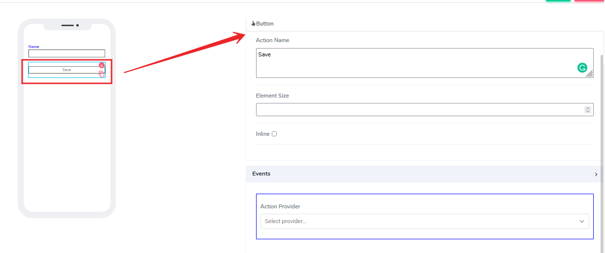

# Button Element

Button elements can be used for both **Forms** and **Cards**. Users are very much familiar with so called "buttons" and how they ficilitate an action when clicked. 

It comes with the following attributes

- **Action Name** - Free style, multiline text. The text field is read only. The text indicates to the end user what action will follow if they press the button.. 
- **Element Size** - This field is empty by default. User can add a numerical number here to indicate in pixels the size of the button. The lower the size, the smaller the button size is box on the canvas. 
- **Inline** - Handy feature, where if selected, the elemnent gets glued to the previous element on the canvas. If there is no space to be added to the previous element, it position itself with its own dimentions at the begining of the canvas on the row where is located and the next elemnt can be glued to it. 
- **Events** - There are two selections user can do here. One is under Action provider to select for exanmple card functions. Depends on what card functions are available, user can pick in adavnce which one to be associated with the button. Then, after that user can select the actual click action. By default we always provide save and exit action. 

Questions?    <a href="https://www.acenji.com/contact" target="_blank" rel="noopener">Reach us for questions</a>   or <a href="https://github.com/acenji/acenji-help/issues" target="_blank" rel="noopener">post an issue here</a> 

