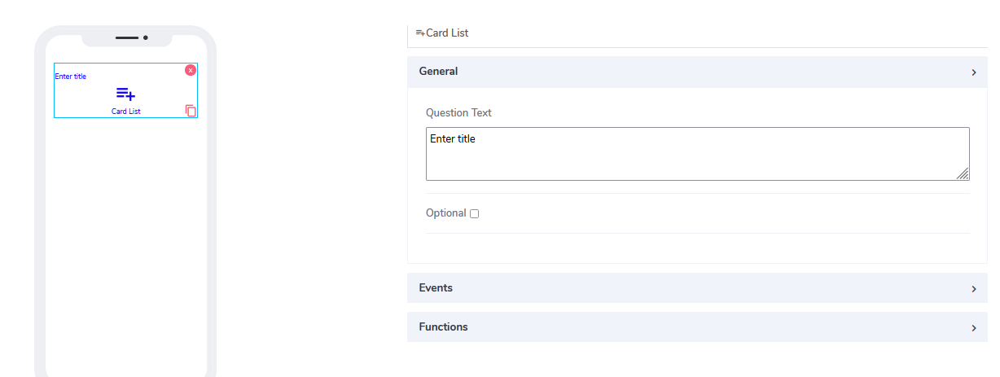
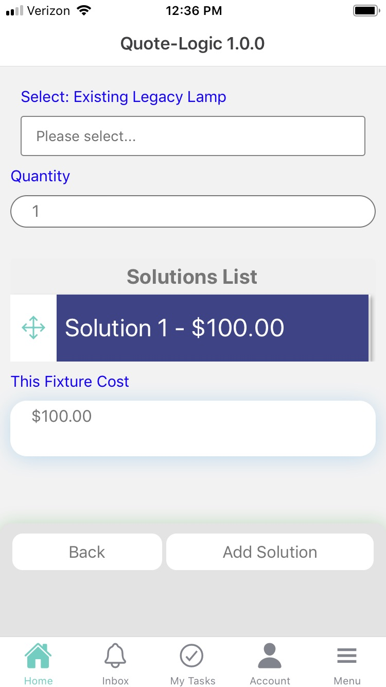
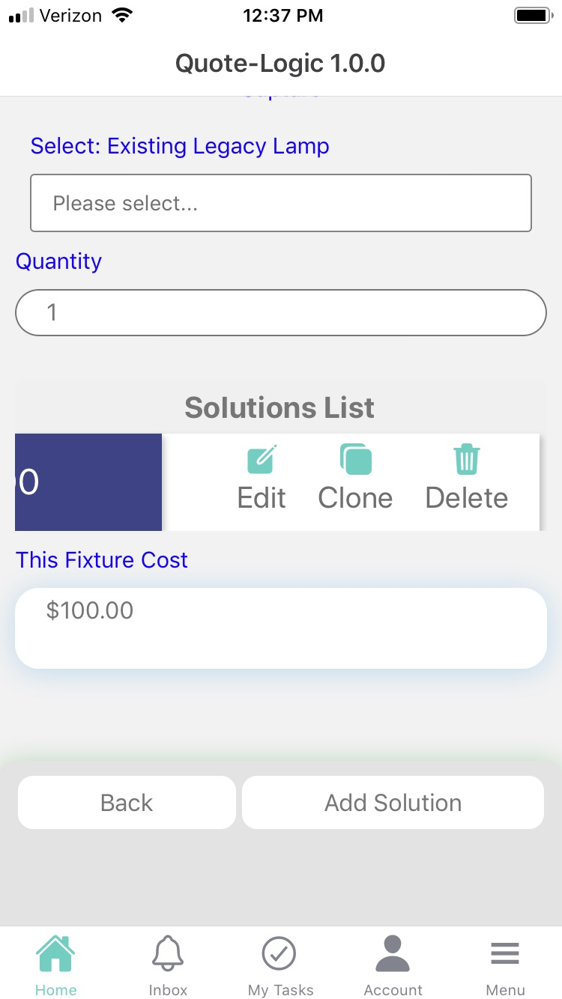
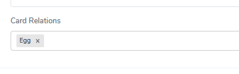
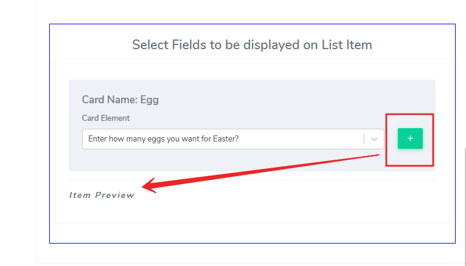

# Card List Element

Card List elements can be used only in **Cards**. They are probably the most fundamental elements for cards and focus on carrying different functionalitires that can help user navigate bettwen apps and withoin the same app. We will demonstrate some use cases, wehre card lists consolidate and project information from other apps, or they trigger events or pass information to other elements. They can be edit, cloned or deleted at run time and are 100% dynamic. Their functionlaity is usually devided between events and functions.  

It comes with the following attributes

- **Qestion Text** - Free style, multiline text. The text field is read only. The text indicates to the end user what action will follow if they press the button..
- **Optional** - Indicate if this element is mandatory to be filled in at run time. By default this is not selected and therefore the element is mandatory.
- **Events** - Provides the ability to connect to same card or different card and define what action to expect from it. Ideally this works as a bridge between cards. By default the following events are built internally: Edit, Clone. The delete event needs to be defined here in advance.
When the card list is presented in mobile, to get to the events, swipe to the left 

  
- **Functions** - They could endless functions added via selection here. For a start, user need to add related cards in the card relationship box

Then under **Actions** add the card that will have some relationship via card list. In our example, we will use previously defined small card called **Egg**.
Since the idea is to bring information from the othjer card(in the example **Egg**) we can specify what elemnts and use calculation fields mechanism to define very complex woirkflow here if we have to. 

Questions?    <a href="https://www.acenji.com/contact" target="_blank" rel="noopener">Reach us for questions</a>   or <a href="https://github.com/acenji/acenji-help/issues" target="_blank" rel="noopener">post an issue here</a> 

