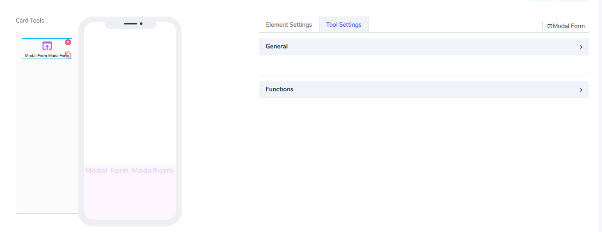
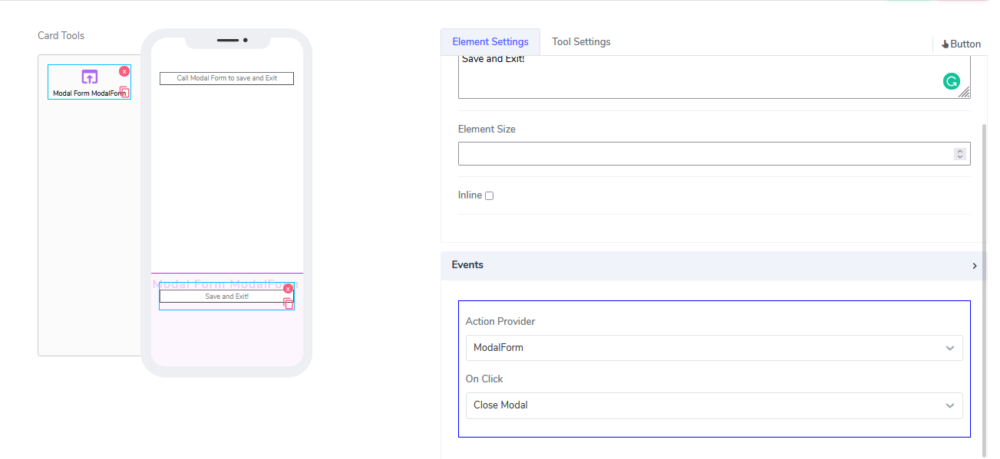
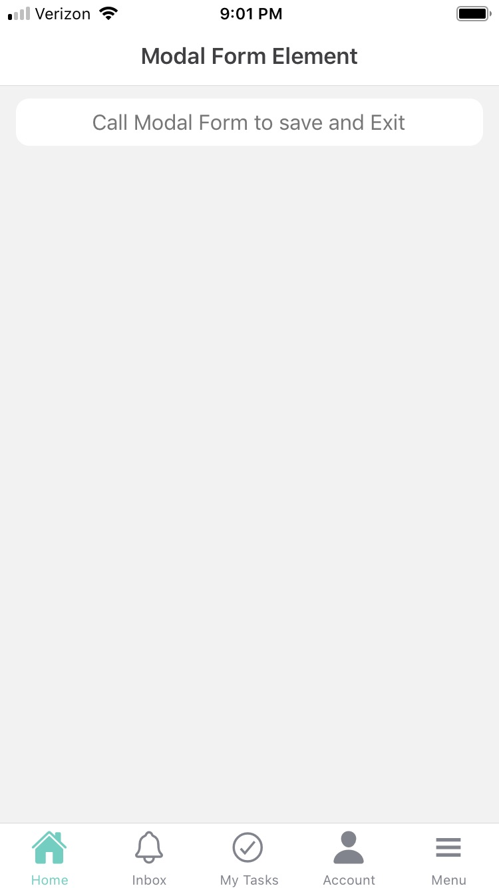
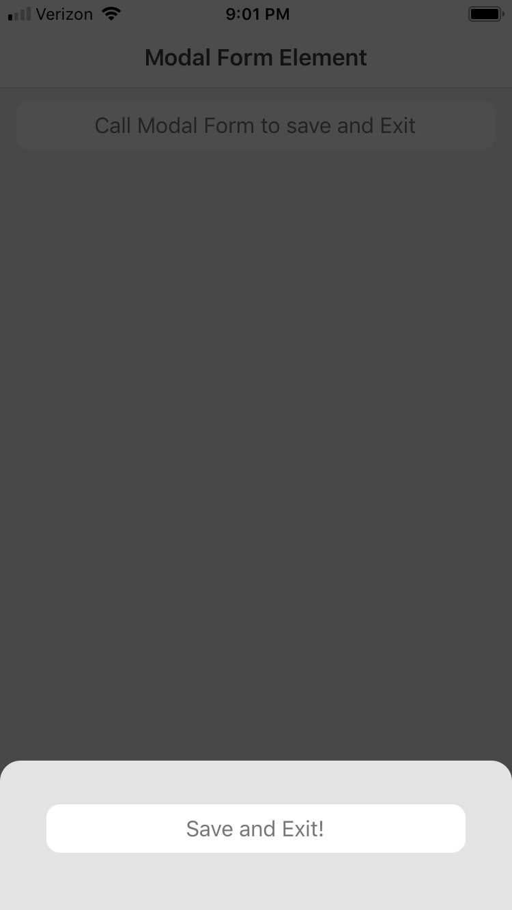

# Modal Form Element

Modal Form elements can be used in **Cards**. For cards, they have simple role: to act as a container for modal "window" that opens on top of exisitng canvas.
Example could be opening an window that ask the user to save or not to save. 

It comes with the following attributes

- **Action Provider** - This attribute is actually not visible at the element level but at the elemnt that invokes the modal form.
For example if we drop a button inside the canvas and on **Events** seelct Action Provider as "ModalForm", Next we specify on click to open the modal form.
Inside the actual modal form we could have another element that lets us do something. Lets add a save and exit button there 

Questions?    <a href="https://www.acenji.com/contact" target="_blank" rel="noopener">Reach us for questions</a>   or <a href="https://github.com/acenji/acenji-help/issues" target="_blank" rel="noopener">post an issue here</a> 

