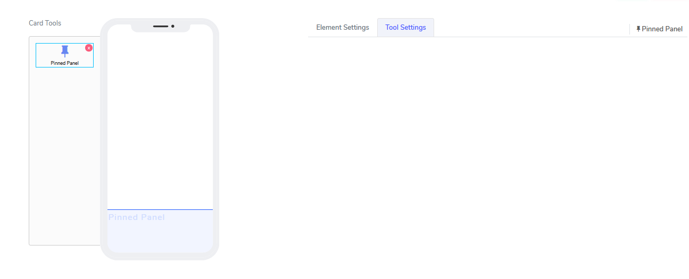
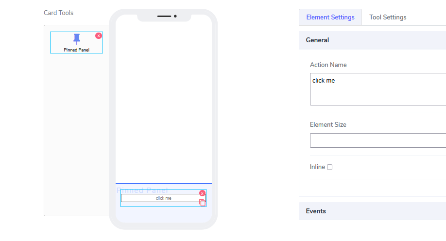
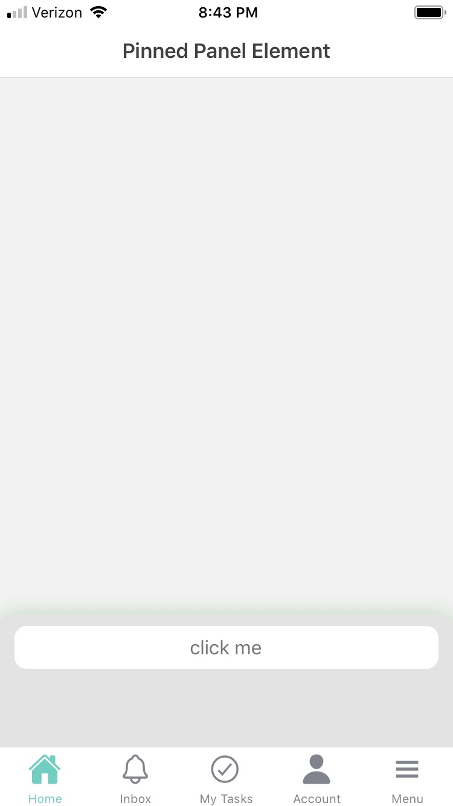

# Pinned Panel Element

Pinned Panel elements can be used only in **Cards**. The idea is very simple: they create an area that is anchored to the bottom of the canvas and accepts new elemnts there. 

It comes with the following attributes

The element does not have visual attributes. All functionality is hidden and works out of the box. Example for a use case is to drop a button there. 

Since this eklement is invisible, the only elements on th acanvas will be those inside the pinned panel.

Questions?    <a href="https://www.acenji.com/contact" target="_blank" rel="noopener">Reach us for questions</a>   or <a href="https://github.com/acenji/acenji-help/issues" target="_blank" rel="noopener">post an issue here</a> 

