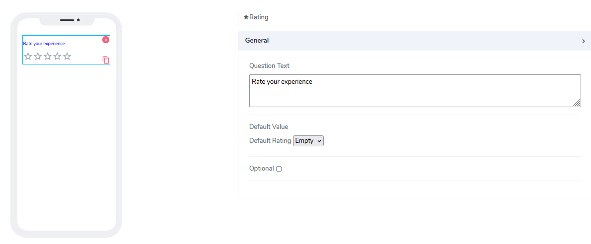
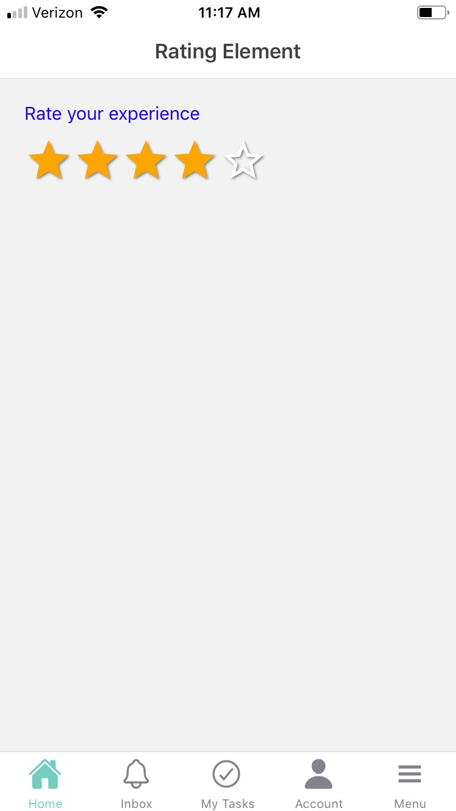

# Rating Element

Rating elements can be used for both **Forms** and **Cards**. The idea is to provide the user with th eability to rate some question from the scale of one to 5. The actual values are represenetd as stars that are like buttons. If user clicks on star number 2 , the first two stars are filled to indicate the action. 

It comes with the following attributes

- **Qestion Text** - Free style, multiline text. The text field is read only. The text indicates to end user what information they need to add an an input. 
- **Default Value** - By default this element comes as an optional. Information can be placed here at design time or at run time via calculated field function (see below). Default value of empty is assigned to help user what this represent as a hint. User can choose from empty, 1,2,3,4,5 as values. 
- **Optional** - Indicate if this element is mandatory to be filled in at run time. By default this is not selected and therefore the element is mandatory. 

Questions?    <a href="https://www.acenji.com/contact" target="_blank" rel="noopener">Reach us for questions</a>   or <a href="https://github.com/acenji/acenji-help/issues" target="_blank" rel="noopener">post an issue here</a> 

