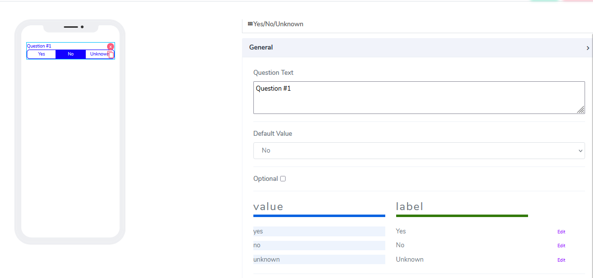
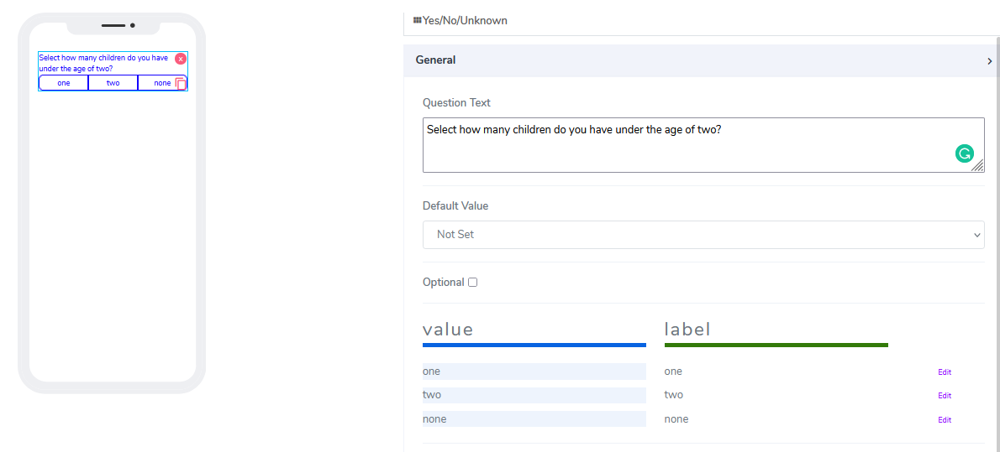
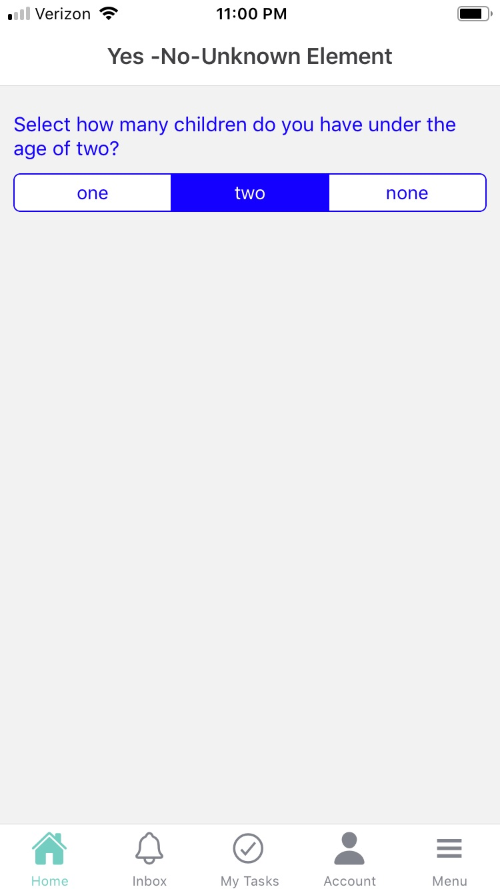

# Yes, No, Unknown Element

Yes, NO, Unknown elements can be used for both **Forms** and **Cards**. The idea to give users single choice from multiple set of items but working as radio button. User can create unlimited number of items as pert of the set. 

It comes with the following attributes

- **Qestion Text** - Free style, multiline text. The text field is read only. The text indicates to end user what information they need to add an an input. 
- **Default Value** - User has the ability to set of of the set items as preselected. 
- **Optional** - Indicate if this element is mandatory to be filled in at run time. By default this is not selected and therefore the element is mandatory.
- **Values and Labels** - These two field come as pair. User can overwrite the default three values and labels. Keep in mind no deselect is allowed. 

Actual implementation in mobile looks like that:

Questions?    <a href="https://www.acenji.com/contact" target="_blank" rel="noopener">Reach us for questions</a>   or <a href="https://github.com/acenji/acenji-help/issues" target="_blank" rel="noopener">post an issue here</a> 

