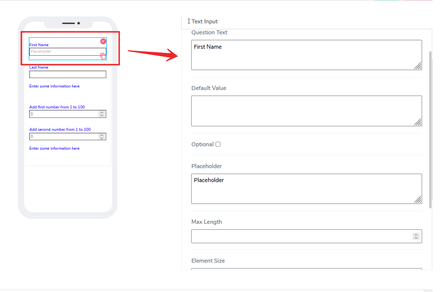
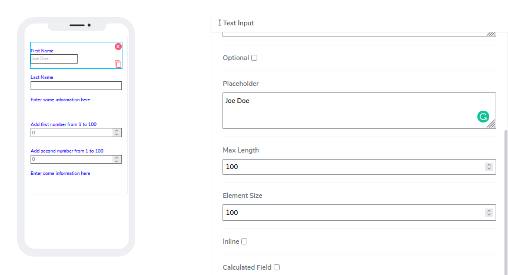
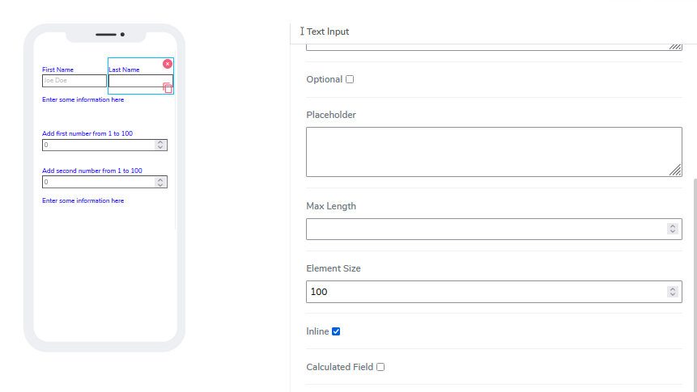
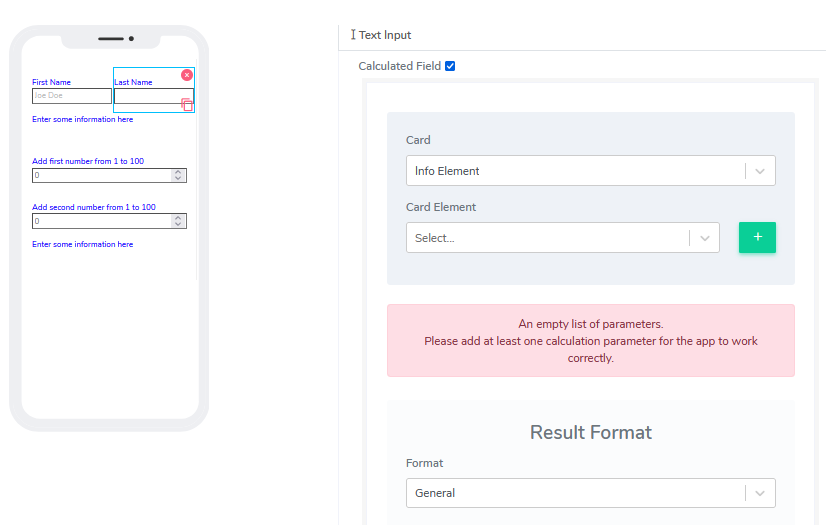

# Text input Element

Text Input elements can be used for both **Forms** and **Cards**. Users are very much familiar with so called "text boxes" and how data is entered. 

It comes with the following attributes

- **Qestion Text** - Free style, multiline text. The text field is read only. The text indicaets to end user what informatuion they need to add an an input. 
- **Default Value** - By default this element comes as an optional. Information can be placed here at design time or at run time via calculated field function (see below). 
- **Optional** - Indicate if this element is mandatory to be filled in at run time. By default this is not selected and therefore the element is mandatory. 
- **Placeholder** - This is used as a hint to specify expected value in the input box. If clean, nothing will display.
- **Max Length** - User can put restrictions how long the text input in number of characters can be. 
- **Element Size** - This field is empty by default. User can add a numerical number here to indicate in pixels the size of the info message. The lower the size, the more lines are allocated to the text in order to define that size as a box on the canvas.

- **Inline** - Handy feature, where if selected the elemnent gets glued to the previous element on the canvas. If there is no space to be added to the previous element, it position itself with its own dimentions at the begining of the canvas on the row where is located and the next elemnt can be glued to it.

- **Calculated Field** - By default this is not selected. If user selects that option, the following image will open:

Calculated field for Text element is identical to how works as [Info element](../../tutorials/cards/info/index.md).

Questions?    <a href="https://www.acenji.com/contact" target="_blank" rel="noopener">Reach us for questions</a>   or <a href="https://github.com/acenji/acenji-help/issues" target="_blank" rel="noopener">post an issue here</a> 

